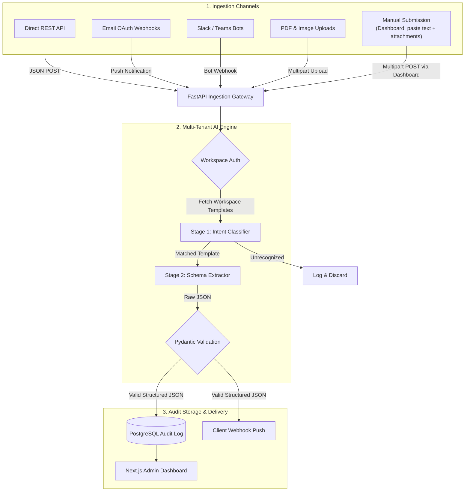

# Architecture & Data Flow

## Overview

Multi-tenant pipeline: ingest unstructured data → classify intent → extract structured JSON → validate → store + deliver.

Data can enter the pipeline via two modes:
- **Automated** — email OAuth webhooks, REST API pushes, bot integrations
- **Manual** — user pastes email/document text (+ optional file attachments) directly into the admin dashboard

Both modes converge on the same FastAPI ingestion endpoint and follow the identical AI processing pipeline downstream.

### Implementation Strategy: Manual-First Vertical Slice
To eliminate external OAuth setup friction and accelerate feedback loops during development, the system is built as a **Manual-First Vertical Slice** (see [ADR-002](file:///home/ajay/Projects/personal/Intelligent-Data-Extraction/docs/adr/002-manual-first-vertical-slice.md)). We implement and validate the full end-to-end pipeline via manual paste/file submission before attaching automated email webhooks.

## Data Flow



## Email Ingestion — Two Modes

Email data can enter the pipeline in two distinct ways:

| Mode | How it works | Setup required |
|---|---|---|
| **Automated (OAuth Webhook)** | External email service (e.g. Gmail, Outlook) pushes new emails to the API via a registered webhook. Fully hands-off once configured. | OAuth app registration + webhook URL in email provider |
| **Manual Submission** | A user opens the **Submit Document** screen in the admin dashboard, pastes the email body text into a rich text area, and optionally attaches files (PDF, PNG, JPEG). Hits the same `/ingest` endpoint. | None — available to any authenticated workspace user |

## Admin Dashboard — Key Screens

The Next.js frontend exposes these primary screens to authenticated workspace users:

| Screen | Route (planned) | Purpose |
|---|---|---|
| **Dashboard / Overview** | `/` | Extraction volume, recent activity, error rate |
| **Submit Document** | `/submit` | **Manual ingestion**: paste email body text + optional file attachments (PDF, PNG, JPEG). Posts to `/api/ingest` just like any automated channel. |
| **Extraction Logs** | `/logs` | Full history of ingested documents with status, matched template, extracted JSON, and any validation errors |
| **Templates** | `/templates` | Create, edit, and delete workspace-specific extraction schemas that Gemini uses as targets |
| **Settings / Integrations** | `/settings` | Manage API keys, webhook endpoints, email OAuth setup, team members |

> The **Submit Document** screen is intentionally designed for cases where automated ingestion isn't set up yet, or where an operator needs to manually process a one-off document without wiring up a webhook. It is a first-class ingestion path, not a workaround.

---

## Tech Stack

| Layer | Technology |
|---|---|
| Backend | Python, FastAPI, Pydantic |
| AI Engine | Google Gemini 1.5 Flash |
| Database | PostgreSQL, Prisma ORM |
| Frontend | Next.js (TypeScript) |
| Auth | JWT + optional Google OAuth |

## Repository Structure

```
intelligent-data-extraction/
├── README.md
├── MEMORY.md
├── docs/
│   ├── architecture.md     ← you are here
│   ├── deployment.md
│   └── adr/                ← decision records
├── backend/
│   ├── .env.example        # backend env template
│   ├── prisma/
│   │   └── schema.prisma   # DB schema — run all prisma commands from backend/
│   └── app/
│       ├── api/            # endpoints: ingest, templates, auth, logs
│       ├── core/           # config, security, auth
│       ├── models/         # Pydantic schemas
│       ├── services/       # Gemini logic, webhook dispatcher
│       └── main.py
└── frontend/
    ├── .env.example        # frontend env template
    └── src/
```
