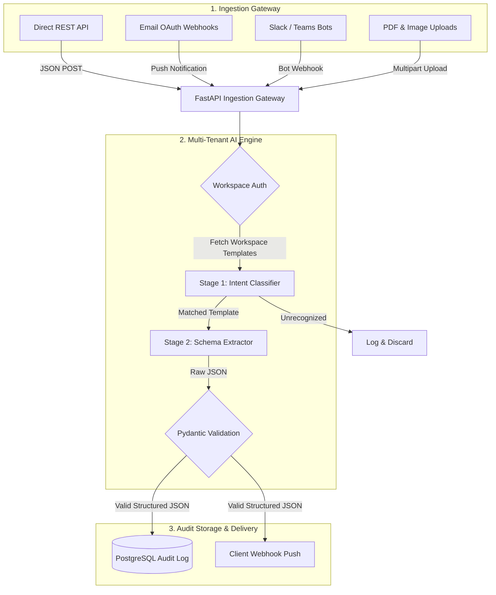

# Architecture & Data Flow

## Overview

Multi-tenant pipeline: ingest unstructured data → classify intent → extract structured JSON → validate → store + deliver.

## Data Flow



## Tech Stack

| Layer | Technology |
|---|---|
| Backend | Python, FastAPI, Pydantic |
| AI Engine | Google Gemini 1.5 Flash |
| Database | PostgreSQL, Prisma ORM |
| Frontend | Next.js (TypeScript) |
| Auth | JWT + optional Google OAuth |

## Repository Structure

```
intelligent-data-extraction/
├── .env.example
├── README.md
├── MEMORY.md
├── docs/
│   ├── architecture.md     ← you are here
│   ├── deployment.md
│   └── adr/                ← decision records
├── backend/
│   └── app/
│       ├── api/            # endpoints: ingest, templates, auth, logs
│       ├── core/           # config, security, auth
│       ├── models/         # Pydantic schemas
│       ├── services/       # Gemini logic, webhook dispatcher
│       └── main.py
├── frontend/
│   ├── src/
│   └── .env.local          # symlink → ../.env
└── prisma/
    └── schema.prisma
```
